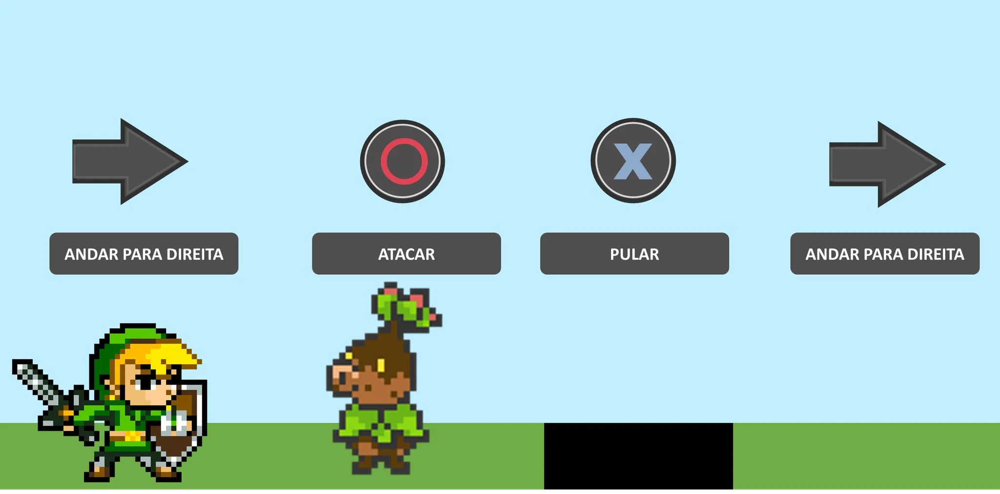
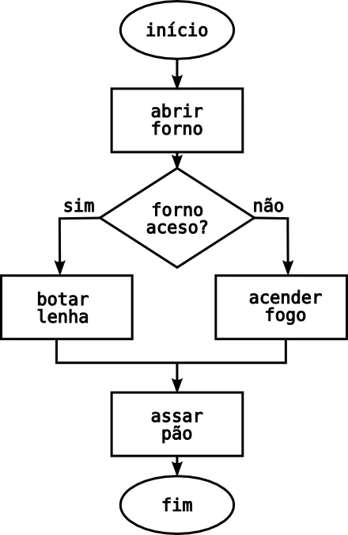
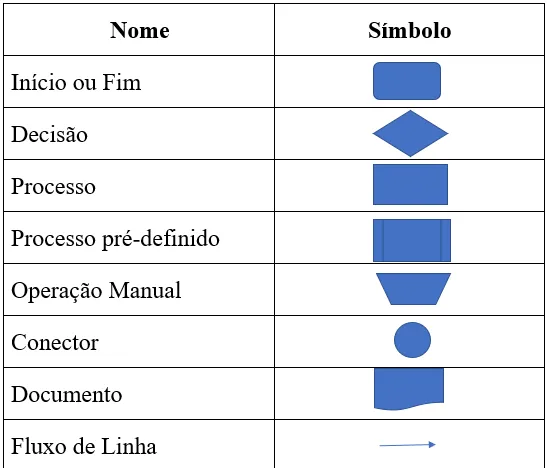

# Algoritmos

Algoritmo é como uma sequência de passos para resolver um problema. Pense em um jogo aonde um heroi está a um passo do inimigo e precisa acerta-lo, para isso é preciso fazer uma sequência logica

O algoritmo é a sequência lógica de ações que devem ser executadas para resolver um problema

## Fluxograma

Fluxograma é um diagrama que define os passos de alguma determinada tarefa por meio de caixas especiais que tem seu significado

Tabela dos simbolos de um Fluxograma:

