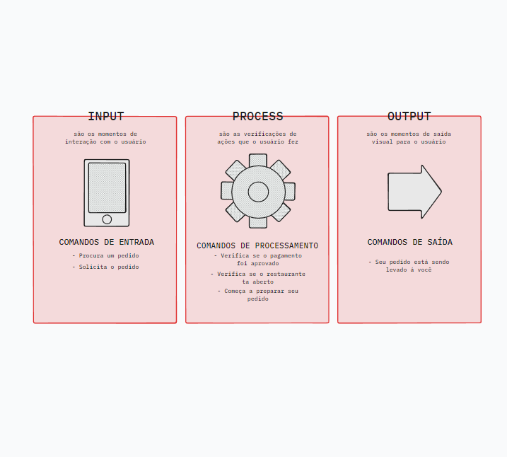

# Input, Process e Output

São processos que definem por partes o funcionamento de algum programa

Por exemplo:

Esses passos servem para fazer com que qualquer programa funcione 

## Features

Features são os conjuntos dos processos que vimos acima para fazer com que outros processos funcionem

